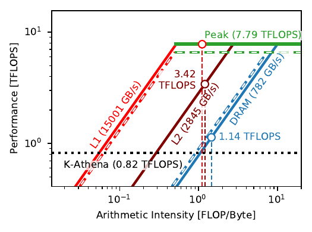
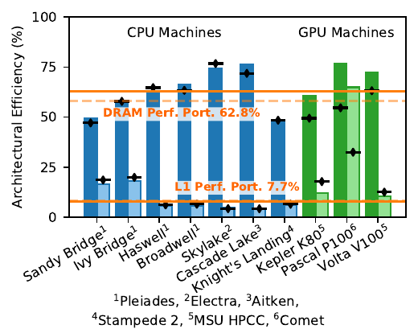

K-Athena is a partial conversion of Athena++, using Kokkos for performance
portability, meaning that it runs efficiently on CPUs and GPUs. The code is a
precursor to the Parthenon and AthenaPK projects, implementing only uniform
grids efficiently when running on GPUs. However, the code was a valuable proof
of concept for a performance-portable magnetohydrodynamics code, allowing
future exascale simulations to be unconstrained by niche architectures.

K-Athena is publicly available on [gitlab](https://gitlab.com/pgrete/kathena).

As part of the development effort, we quantified the performance portability of
code using roofline models. We constructed roofline models on each
of the CPU and GPU devices on which we tested K-Athena. Roofline models allow
estimations of the theoretical peak throughput of a code as limited by its
arithmetic intensity (the number of operations execute per byte loaded) and by
the bandwidths and computational throughputs of the hardware. By comparing the
actual efficiency achieved to the theoretical efficiency for each architecture,
we  obtain a performance efficiency for each machine that can be directly
compared, even if the architectures are very different.

Roofline model of an NVIDIA Tesla V100 with the arithmetic intensity of
K-Athena, showing performance in TFLOPS versus arithmetic intensity in floating
point operations execute per byte loaded and written. Throughputs appear as
horizontal ceilings, bandwidths of the different memory spaces of the hardware
appear as diagonal ceilings, and arithmetic intensities of the code appear as
vertical lines. The intersect of an arithmetic intensity with a bandwidth or
throughput ceiling show the theoretical throughput ceiling imposed by that
bandwidth or throughput. We generated rooflines for all architectures on which
we profiled K-Athena.

Efficiency achieved on each architecture on which we profiled K-Athena, showing
the percentage performance achieved out of the theoretical performance as
limited by the DRAM and L1 memory for each architecture. By taking the harmonic
mean of these efficiencies we arrive at a performance portability measure. The
implementation of K-Athena (and similar MHD codes) is typically limited by the
DRAM bandwidth, leading to a performance portability of 62.8%. Less efficiency
utilization of the L1 cache on almost all architectures leads to a 7.7%
performance portability with respect to the L1 cache.

Our full method description and performance analysis can be found in
[IEEE Transactions on Parallel and Distributed Systems](https://doi.org/10.1109/TPDS.2020.3010016).

