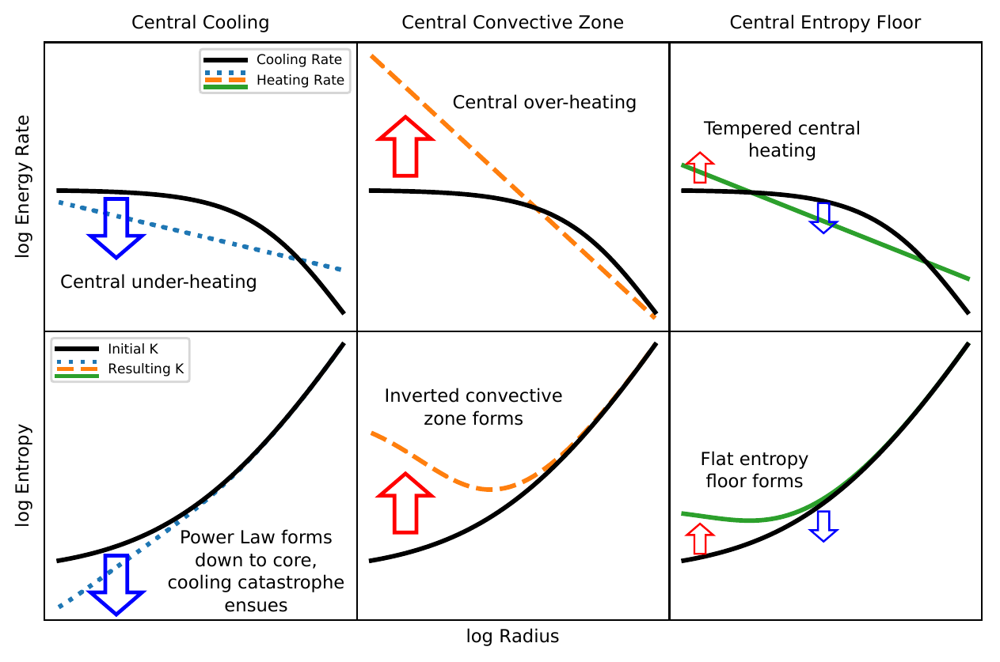
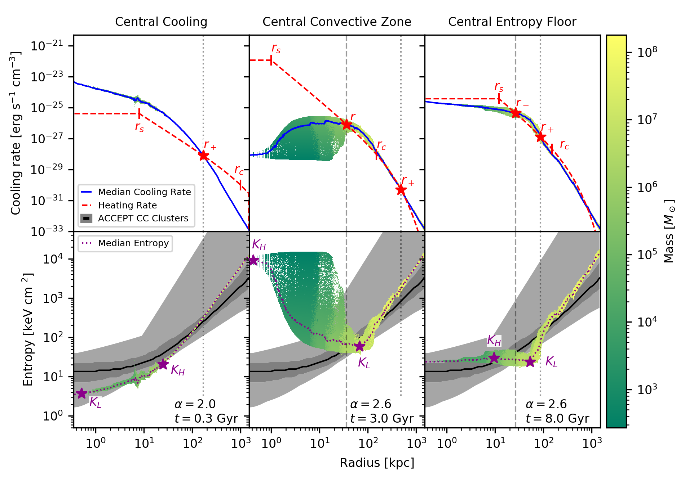

Using hydrodynamic simulations of idealized galaxy clusters with Enzo, we investigated whether purely thermal AGN feedback models could replicate the cool-core clusters produced by kinetic jet AGN feedback models. Such a purely thermal feedback model would serve as a theoretical approximation of energy deposition by AGN jets. Although we found no such purely thermal heating kernel that maintained a cool-core cluster, we did develop a model between the radial deposition of energy by the AGN, the entropy profile of the cluster, and the stability of the cluster.

We identified three potential outcomes:
- Centrally underheating kernels, which lead to early cooling catastrophes.
-  Centrally overheating kernels, which lead to unphysically elevated central entropies but ultimately stable clusters.
-  Centrally intermediately heating kernels, which balance a reasonable central entropy
These outcomes were borne out in the simulations depending on how centrally concentrated the AGN heating was.

Full explanations and descriptions are available in our paper [in the Astrophysical Journal](https://doi.org/10.3847/1538-4357/abb08c)
